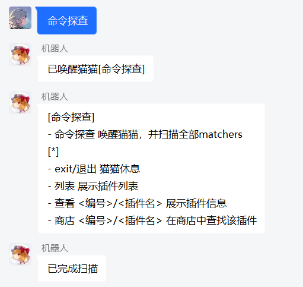
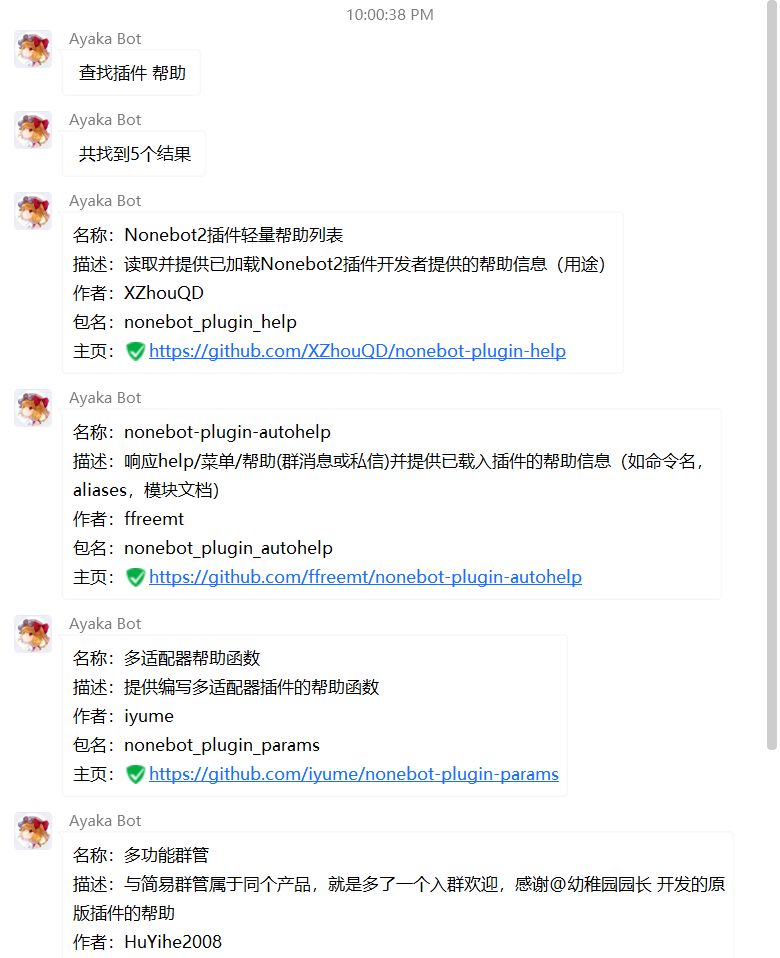
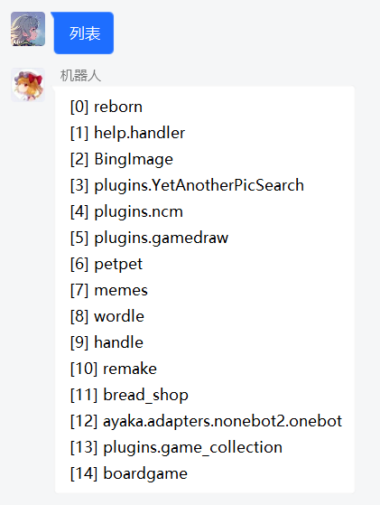
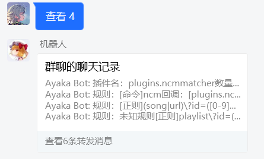
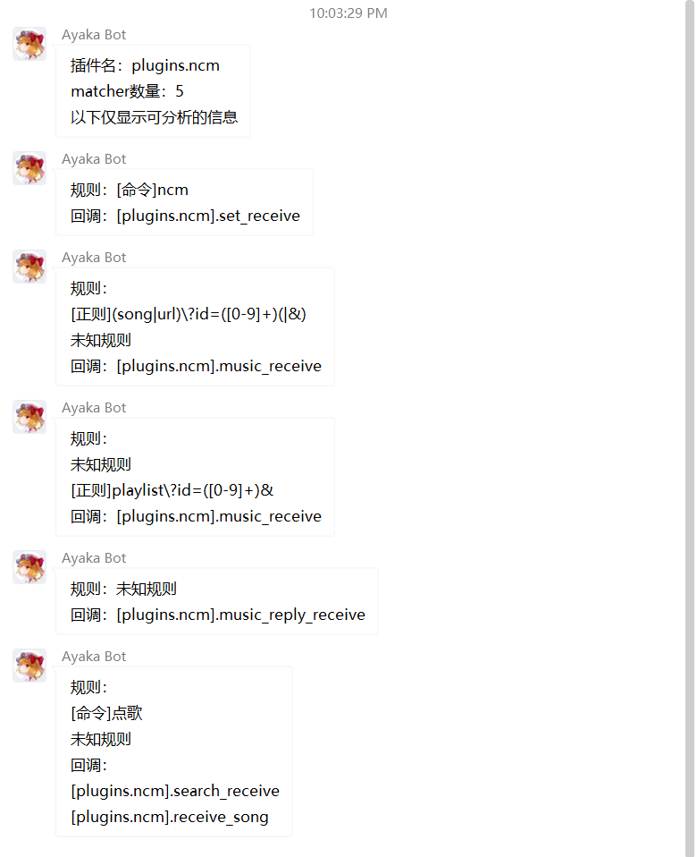

# 命令探查 0.1.0b0

猜测未知插件的使用方法

## 使用方法

| 命令     | 效果       |
| -------- | ---------- |
| 命令探查 | 启动本插件 |
| 退出     | 关闭本插件 |

启动本插件后，发送命令

| 命令                 | 效果                       |
| -------------------- | -------------------------- |
| 列表                 | 查看所有已安装的插件的名称 |
| 查看 `编号`/`插件名` | 查看指定插件的命令         |
| 商店 `编号`/`插件名` | 在nb商店中搜索插件的信息   |

## 使用效果 

## 实现原理

遍历`nonebot.matcher.matchers`对象，分析所有`Matcher`

下载`https://raw.githubusercontent.com/nonebot/nonebot2/master/website/static/plugins.json`，获取插件信息
